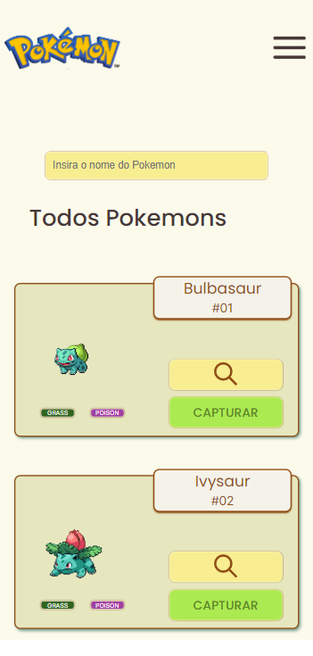
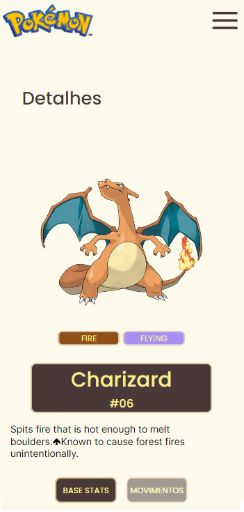
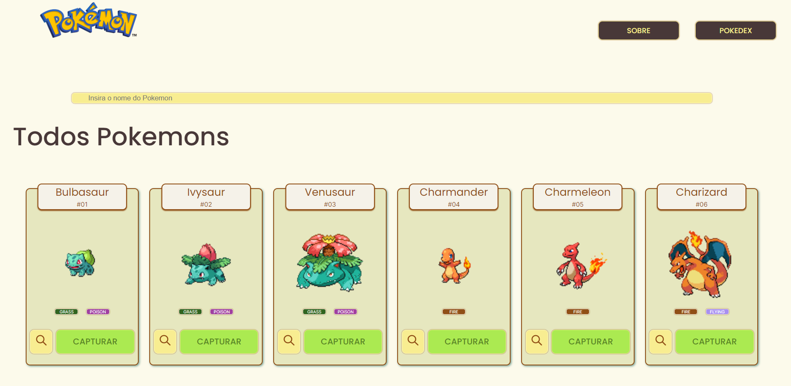

# Pokedex 

## 📖 Introdução 

A Pokedex é uma aplicação web que contém as principais informações dos 1008 pokemons, como: nome, tipo, movimentos, entre outros, utilizando a API [PokeApi](https://pokeapi.co/).

### Instalando
```bash
# Instalando dependências
npm install

# executando o projeto
npm start
```

### Layout Mobile

| <br><sub>Home Page</sub> | <br><sub>Detalhes</sub> |
| :---: | :---: |

### Layout Desktop

| <br> |
| :---: |


### Funcionalidades
```bash
. Listagem: Listagem de todos os 1008 pokemons existentes, organizados por página (20 em cada);
. Filtro: Filtrar pokemon pelo nome;
. Detalhes: Cada card exibirá informações detalhadas como Base Stats (estatisticas) e Movimentos ao ser clicado;
. Captura: Adicionar pokemons a sua Pokedex pessoal;
. Responsividade: Aplicação totalmente responsiva para Desktop, Tablet e Celulares;
```

### Bibliotecas Utilizadas

```bash
styled-components
axios
react-router-dom
```

## 💡Programas utilizados:
- VSCode

## 📫 Contato

E-mail: elenilsonsantos9@gmail.com 
